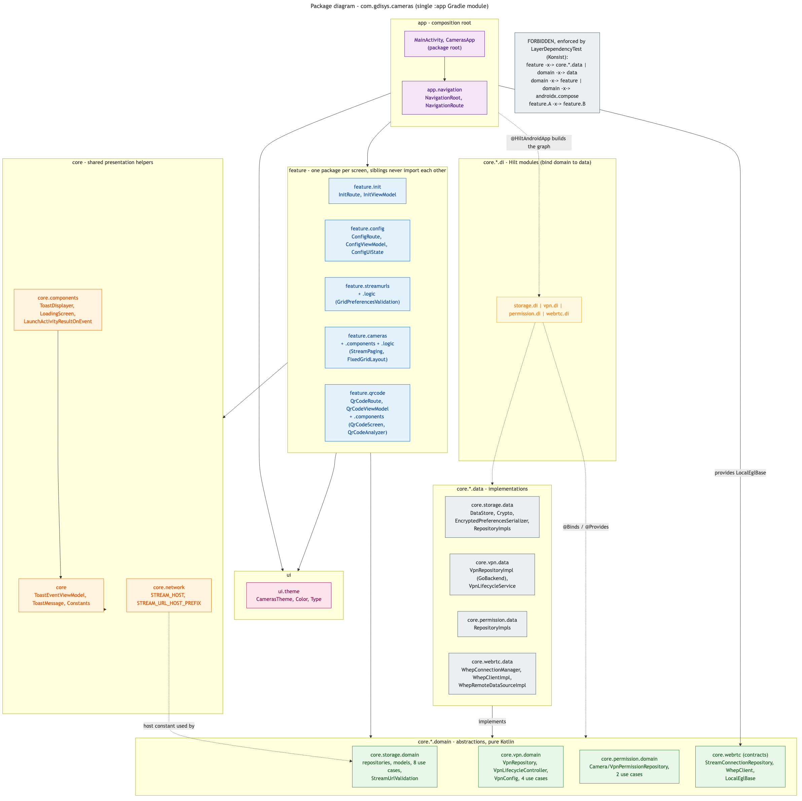
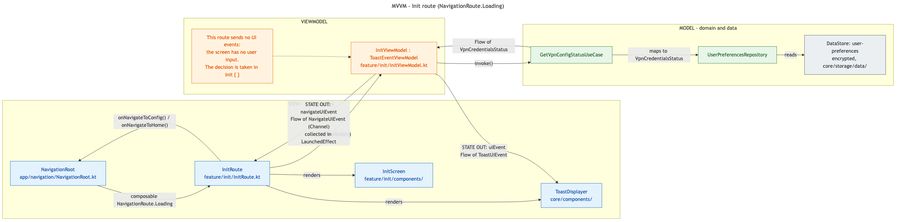
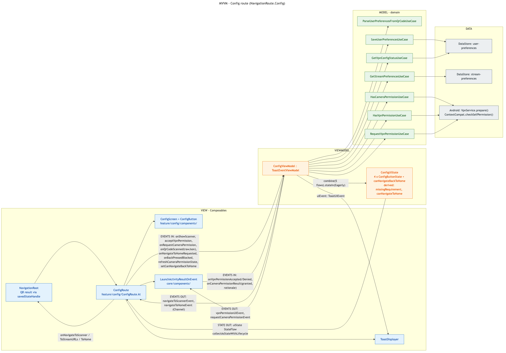
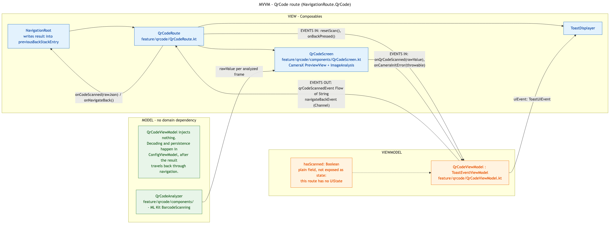
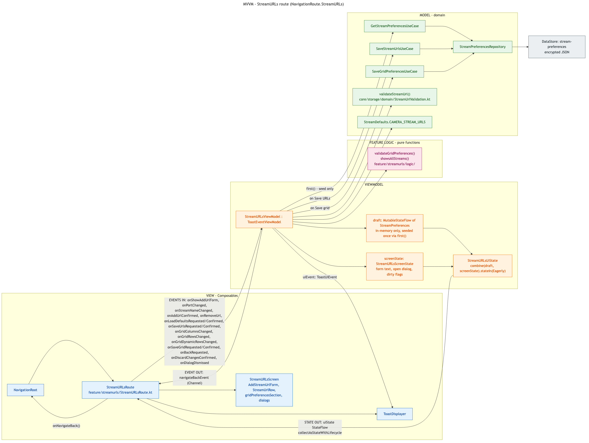
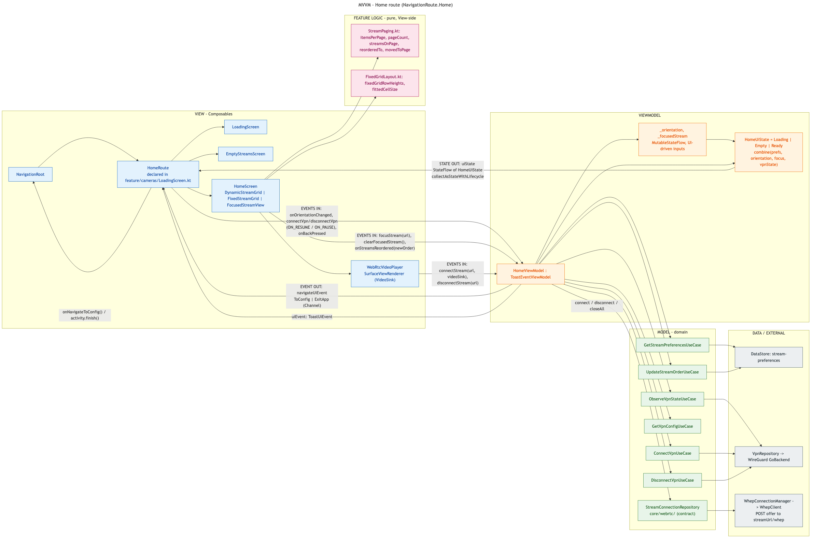
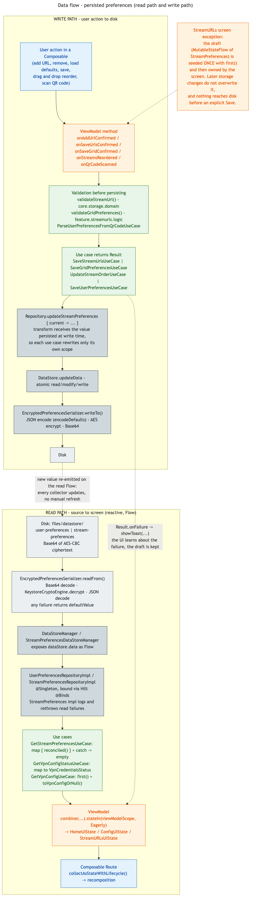
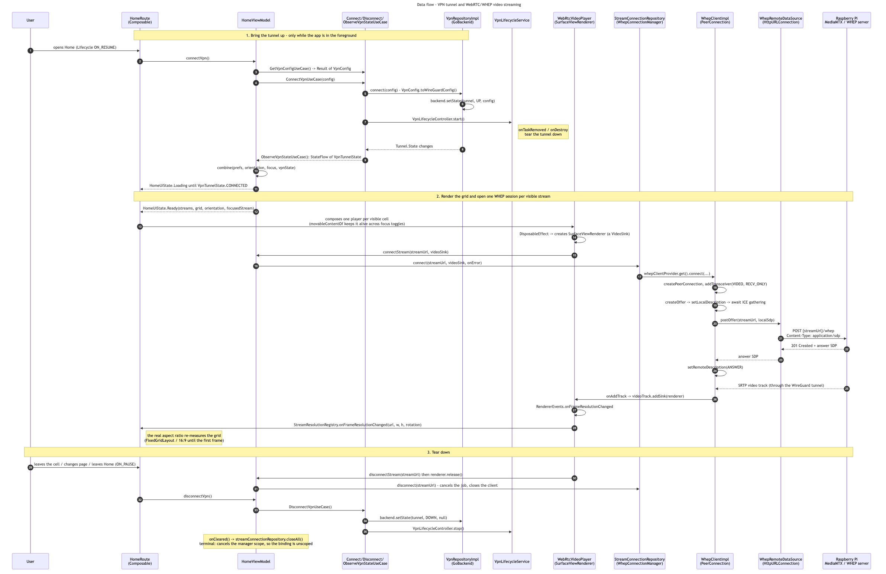

# Cameras App — Technical Architecture

Onboarding reference for Android developers joining this project.

| | |
|---|---|
| **Reference commit** | `51092384ff1b2b13670e8876e7c1c85ecf751fb7` |
| **Branch** | `refactor/adjustments_1` |
| **Commit date** | 2026-09-21 |
| **Subject** | `docs: record the deliberate core/webrtc exception and the open gaps` |
| **Application ID** | `com.gdisys.cameras` |
| **Gradle modules** | a single `:app` module |

Everything described below reflects the tree at that commit. Paths are given relative to the
repository root.

---

## Table of contents

1. [What the app does](#1-what-the-app-does)
2. [Stack and build configuration](#2-stack-and-build-configuration)
3. [Architecture: layers and packages](#3-architecture-layers-and-packages)
4. [Navigation and route inventory](#4-navigation-and-route-inventory)
5. [Features and their MVVM organization](#5-features-and-their-mvvm-organization)
6. [Core packages](#6-core-packages)
7. [Data flow](#7-data-flow)
8. [External resources](#8-external-resources)
9. [Architectural consistency notes](#9-architectural-consistency-notes)
10. [Testing and quality gates](#10-testing-and-quality-gates)
11. [Where to start reading](#11-where-to-start-reading)
12. [Regenerating the diagrams](#12-regenerating-the-diagrams)

---

## 1. What the app does

The app is a native Android client for remotely watching IP cameras hosted on a private home
network, with no third-party cloud in the video path.

The end-to-end setup (only the Android client lives in this repository):

- IP cameras publish **RTSP** on the local network.
- A **Raspberry Pi** on that network ingests RTSP and re-publishes it as **WebRTC / WHEP**.
- A **WireGuard VPN over IPv6** gives the phone direct point-to-point access to that network.
- This app reads the WireGuard credentials from a **QR code**, brings the tunnel up **only while
  it is in the foreground**, and renders one WebRTC video per camera in a configurable grid.

Three product decisions shape most of the code:

1. **The tunnel is foreground-only.** It is raised on `Lifecycle.Event.ON_RESUME` of the Home route
   and dropped on `ON_PAUSE`, with `VpnLifecycleService` as the safety net for task removal. The
   tunnel is IPv6-only and routes `::/0`, so leaving it up would degrade unrelated apps.
2. **Everything persisted is encrypted at rest.** Both DataStore files are AES-encrypted with a
   key held in the Android Keystore, because one of them holds WireGuard private key material.
3. **The stream set is user-configurable.** URLs, display order (per orientation) and grid geometry
   (per orientation) are all editable in-app and persisted.

---

## 2. Stack and build configuration

| Concern | Choice |
|---|---|
| Language | Kotlin 2.3.20 |
| UI | Jetpack Compose (BOM 2026.03.01), Material 3 |
| Architecture | MVVM + Clean-Architecture-style layering (`domain` / `data`) |
| DI | Hilt 2.59.2 + KSP |
| Navigation | `navigation-compose` 2.9.8, type-safe routes via `kotlinx.serialization` |
| Async | Coroutines + `Flow` / `StateFlow` / `Channel` |
| Persistence | Jetpack DataStore (typed, custom serializer) + Android Keystore |
| VPN | `com.wireguard.android:tunnel` (`GoBackend`) |
| Video | `io.getstream:stream-webrtc-android` (WHEP over plain `HttpURLConnection`) |
| QR scanning | CameraX + ML Kit Barcode Scanning |
| Build | Gradle KTS + version catalog (`gradle/libs.versions.toml`) |
| Coverage | JaCoCo 0.8.12, custom `:app:jacocoTestReport` + `:app:jacocoTestCoverageVerification` (90% LINE) |
| Arch enforcement | Konsist 0.17.3 (`LayerDependencyTest`) |
| CI | GitHub Actions — `[DEV] BUILD` and `[PRD] BUILD` (§10.1) |

**SDK levels:** `minSdk 26`, `targetSdk 36`, `compileSdk 36`, Java 17.

**The two variants install side by side.** The debug build type sets
`applicationIdSuffix = ".debug"`, so a debug APK and a release APK are two distinct apps with
distinct data directories, Keystore entries and backup sets:

| | Application id | `versionName` | Launcher label |
|---|---|---|---|
| `debug` | `com.gdisys.cameras.debug` | `1.0-debug` | Cameras (debug) |
| `release` | `com.gdisys.cameras` | `1.0`, or the tag's version | Cameras |

Without the suffix both claim `com.gdisys.cameras`, and because they are signed with different
keys (the debug key vs. the release key) Android treats an install of one over the other as a
signature mismatch and refuses it — the practical effect being that you cannot keep a development
build and the real app on the same device. The `versionNameSuffix` and the debug-only `app_name`
override in `src/debug/res/values*/` exist so the two are also *distinguishable* once installed;
otherwise they differ only by an id nobody reads.

This moves the **application id**, not the namespace. `com.gdisys.cameras` remains the namespace,
which is what the R class and the relative component names in `AndroidManifest.xml`
(`.MainActivity`, `.CamerasApp`, `.core.vpn.data.VpnLifecycleService`) resolve against — the merged
debug manifest declares `package="com.gdisys.cameras.debug"` while still pointing at
`com.gdisys.cameras.MainActivity`. So Konsist's `LayerDependencyTest` still sees one package tree,
and `GoBackend$VpnService` is unaffected. Two caveats worth knowing: anything asserting the
installed package name must allow for the suffix (`ExampleInstrumentedTest` asserts the namespace
prefix rather than one literal id), and although both apps can be installed, Android still allows
only one active VPN at a time, so only one of them can hold the tunnel up.

Compose is configured by the Compose Compiler Gradle plugin (`libs.plugins.compose.compiler`), the
only supported mechanism on Kotlin 2.x — there is no `composeOptions` block, and adding one back
would be inert.

**Release builds are minified.** `isMinifyEnabled = true` with
`proguard-android-optimize.txt` + `proguard-rules.pro`, so that file is now the contract between R8
and the parts of the app it cannot see. It holds three keep blocks, each with its rationale next to
it:

| Keep block | Why R8 cannot infer it |
|---|---|
| `kotlinx.serialization` | Serializers are looked up at runtime from the annotated class's `Companion` / `INSTANCE`. Covers the on-disk schema, the QR payload and the type-safe navigation routes. The generated `com.gdisys.cameras.**$$serializer` classes are kept with `includedescriptorclasses` |
| `ComponentRegistrar` implementors (`<init>()`) | ML Kit discovers its registrars from manifest `<meta-data>` *values* and instantiates them reflectively — see below |
| `org.webrtc.**` | The native layer instantiates classes, calls methods and reads fields by name through JNI |
| `com.wireguard.**` | `GoBackend`'s native symbols are bound by fully qualified Java name; `GoBackend$VpnService` is also named in the manifest |

Hilt/Dagger, AndroidX and CameraX ship consumer rules that cover them, and are deliberately not
repeated.

**The ML Kit rule is worth understanding, because it is a whole class of bug.** ML Kit's own
consumer rules keep the *names* of `BarcodeRegistrar`, `VisionCommonRegistrar` and
`CommonComponentRegistrar`, but R8 in full mode — the AGP 8+ default — removes the default
constructor of a class that nothing constructs in code, and these are only ever constructed by
`ComponentDiscovery` through `Class.forName(name).newInstance()`. Discovery swallows the resulting
failure, so the barcode component is simply never registered and `BarcodeScanning.getClient()`
throws an NPE the moment the QR screen builds its analyzer. Keeping the class name is not enough;
the rule has to keep `<init>()`. Any future dependency that is instantiated reflectively will fail
the same silent way.

The caveat that kept minification off for so long has not gone away: a wrong keep rule fails at
*runtime*, so a green `assembleRelease` is necessary but not sufficient. Any change to the keep
rules, to a `@Serializable` model, or to the VPN/WebRTC dependencies has to be smoke-tested on a
real device — scan the QR code, bring the tunnel up, play a stream. The rule set above was
validated that way end to end on a physical device: QR scan, tunnel up, streams rendering.
`SourceFile` and `LineNumberTable` are kept so release stack traces can be de-obfuscated with
`app/build/outputs/mapping/release/mapping.txt`.

Code shrinking lands the whole app in a single ~4.5 MB `classes.dex`, but the release APK is still
~82 MB: ~74 MB of that is native libraries (`libjingle_peerconnection`, `libbarhopper_v3`,
`libwg-go`) shipped for four ABIs. Minification does not touch those — `isShrinkResources`, ABI
splits or an App Bundle are the levers there, and none of them is enabled.

The build file also defines a bespoke `jacocoTestReport` task that narrows coverage to the
"unit-testable" surface — it excludes generated code, DI, Compose UI, bootstrap, theme, and
anything backed by a native/hardware stack (WebRTC native, `GoBackend`, AndroidKeyStore, Android
`Service`) — and injects a LINE-coverage banner into the HTML report, since JaCoCo's own headline
figure is instruction coverage.

Those exclusions are plain strings with no link to the code, so a rename or a package move would
leave them matching nothing and silently pull the excluded code back into the denominator.
`JacocoExclusionsTest` reads the patterns back out of `app/build.gradle.kts` and resolves each one
against the compiled classes, which turns that drift into a failing test. The build script is
declared as an input of the test task so editing a pattern actually re-runs the guard.

**The coverage minimum is a build rule, not a CI rule.** `jacocoTestCoverageVerification` fails the
build when LINE coverage of that same filtered scope falls below `minimumLineCoverage` (90%), and
both workflows do nothing more than call it — so `./gradlew :app:jacocoTestCoverageVerification`
locally means exactly what CI means, and the threshold has one home. It is stated in LINE rather
than JaCoCo's headline INSTRUCTION figure for the reason the HTML banner exists: instruction
coverage counts bytecode, so on Kotlin a single line expands to a very variable number of
instructions and a long expression outweighs a branch. The two tasks share one definition of the
measured classes, because a gate computed over a different set than the report it is read next to
would be a trap rather than a gate. The task depends on `jacocoTestReport`, so a run that fails the
gate still leaves the report that explains which classes made it fail.

---

## 3. Architecture: layers and packages



The project is **one Gradle module**, so package structure alone carries the layering. Four
top-level package groups live under `com.gdisys.cameras`:

| Group | Role |
|---|---|
| `app/*` | Composition root and navigation: `MainActivity`, `CamerasApp`, `app.navigation` |
| `feature/*` | One package per screen. Route + ViewModel + UiState + `components/` + optional `logic/` |
| `core/*` | Everything shared: `storage`, `vpn`, `webrtc`, `permission`, `network`, `components`, plus the presentation base classes at the package root |
| `ui/*` | `ui.theme` only — `CamerasTheme`, color and typography |

### 3.1 The layering rule

Inside each `core/<area>` the split is the classic Clean Architecture one:

```
core/<area>/domain   <-- abstractions, models, use cases. Pure Kotlin.
core/<area>/data     --> implementations. Knows domain; domain never knows it.
core/<area>/di       --> Hilt modules that bind one to the other.
```

Consumers (`feature/*`, `app/*`) depend on `domain` and receive the implementation by injection.

### 3.2 The rule is enforced by a test, not by the compiler

Because there is only one module, nothing stops a bad import at compile time. That job is done by
`app/src/test/java/com/gdisys/cameras/architecture/LayerDependencyTest.kt`, which uses Konsist to
fail the build on any of these:

| Forbidden | Rationale as stated in the test |
|---|---|
| `feature.*` importing anything matching `.data.` | A feature may only depend on the domain layer |
| `core..domain..` importing `.data.` | The dependency rule points inwards |
| `core..domain..` importing `com.gdisys.cameras.feature.*` | The domain is shared; single-screen rules belong in `feature/<screen>/logic` |
| `core..domain..` importing `androidx.compose.*` | The domain is plain Kotlin, JVM-testable |
| `feature.A` importing `feature.B` | Features are siblings; what they share moves up to `core`, and wiring is navigation's job |

This test is the single most useful thing to read before making a structural change: it tells you
exactly which arrows are allowed.

### 3.3 Where "pure logic" lives

Two kinds of pure, JVM-testable logic coexist:

- **Shared rules → `core/<area>/domain`.** Example: `StreamUrlValidation.kt` (port + stream-name
  validation and URL assembly), `StreamPreferencesExtensions.kt` (`reconciled()`, `orderFor()`,
  `gridFor()`).
- **Single-screen rules → `feature/<screen>/logic`.** Example:
  `feature/cameras/logic/StreamPaging.kt` and `FixedGridLayout.kt` (paging math and row-height
  fitting), `feature/streamurls/logic/GridPreferencesValidation.kt`.

The distinction is deliberate and matches the Konsist rule above: a rule that only serves one
screen must not be promoted into the shared domain.

---

## 4. Navigation and route inventory

`app/navigation/NavigationRoute.kt` declares five type-safe destinations as `@Serializable` objects
inside a `sealed interface`. `NavigationRoot.kt` maps each to a route composable and owns all
inter-screen wiring, including passing the QR-code result back through
`previousBackStackEntry.savedStateHandle`.

| Destination | Route composable | File | ViewModel |
|---|---|---|---|
| `Loading` (start) | `InitRoute` | `feature/init/InitRoute.kt` | `InitViewModel` |
| `Config` | `ConfigRoute` | `feature/config/ConfigRoute.kt` | `ConfigViewModel` |
| `QrCode` | `QrCodeRoute` | `feature/qrcode/QrCodeRoute.kt` | `QrCodeViewModel` |
| `StreamURLs` | `StreamURLsRoute` | `feature/streamurls/StreamURLsRoute.kt` | `StreamURLsViewModel` |
| `Home` | `HomeRoute` | `feature/cameras/HomeRoute.kt` | `HomeViewModel` |

**Navigation shape.** The flow is gated, not linear. `InitRoute` decides between `Config` and
`Home` based on stored credentials. `ConfigRoute` refuses to leave for `Home` until three
requirements are met (credentials, VPN permission, at least one stream URL) and consumes the system
back press with a toast otherwise. `navigateToHome()` pops back to an existing `Home` entry when
there is one, instead of stacking duplicates.

### 4.1 Conventions shared by every route

All five routes follow the same contract, which makes them easy to read once you know the pattern:

- The route composable is the **only** place that touches navigation lambdas, `BackHandler`,
  lifecycle effects and Activity-result launchers. Screens below it are pure and previewable.
- State arrives as `StateFlow` collected with `collectAsStateWithLifecycle()`.
- One-shot effects (navigate, launch an `Intent`, show a toast) arrive as `Channel`-backed `Flow`s
  consumed in `LaunchedEffect`. They are never modeled as state, so they cannot replay on
  recomposition.
- Toasts are centralized: every ViewModel extends `ToastEventViewModel` (`core/ToastEventViewModel.kt`),
  which owns a `Channel<ToastUiEvent>`; every route renders `ToastDisplayer(viewModel.uiEvent)`.
  Message catalogues are per-feature enums implementing `ToastMessage` (`@StringRes`), e.g.
  `HomeToastMessage`, `ConfigToastMessage`.

---

## 5. Features and their MVVM organization

### 5.1 `feature/init` — startup gate



**What it does.** Decides, on launch, whether the user already has valid VPN credentials, and
routes to `Home` or `Config` accordingly.

| Role | Type |
|---|---|
| View | `InitRoute.kt`, `components/InitScreen.kt` |
| ViewModel | `InitViewModel.kt` (`ToastEventViewModel`) |
| Model | `GetVpnConfigStatusUseCase` → `UserPreferencesRepository` |
| Messages | `InitToastMessage` |

This is the only route with **no inbound UI events** — the screen has no input. The decision runs
in the ViewModel's `init { }` block, which collects `GetVpnConfigStatusUseCase()`, ignores
`VpnCredentialsStatus.Loading`, and emits `NavigateUiEvent.ToHome` or (after a toast)
`NavigateUiEvent.ToConfig`.

### 5.2 `feature/config` — configuration checklist



**What it does.** Presents the four setup steps as buttons with a shared `ConfigButtonState`
(`Loading` / `Ready` / `Done` / `Error`): grant camera permission, scan the QR code, grant VPN
permission, configure stream URLs. It then gates navigation to `Home`.

| Role | Type |
|---|---|
| View | `ConfigRoute.kt`, `components/ConfigScreen.kt`, `components/ConfigurationStepButton.kt` |
| ViewModel | `ConfigViewModel.kt` |
| State | `ConfigUiState.kt` — four button states + `canNavigateBackToHome`; derives `missingRequirement`, `canNavigateToHome`, `isQrCodeButtonEnabled` |
| Model | 7 use cases across `storage`, `permission` and `vpn` domains |

Points of interest:

- **State derivation.** `qrCodeButtonState` and `streamURLsButtonState` are each derived as their
  own `Flow` *before* the final `combine`, because the typed `combine` overload tops out at five
  sources and there would otherwise be six. `stateIn` uses `SharingStarted.Eagerly` because the
  navigation gate reads `uiState.value` synchronously at click time.
- **Gating logic lives in the state class, not the ViewModel.** `ConfigUiState.missingRequirement`
  returns the first unmet requirement in feedback order (credentials → VPN permission → URLs), and
  both the "Navigate to Home" click and the blocked back press map it to a toast.
- **Platform round-trips are events, not state.** VPN consent and the camera permission request are
  emitted as `Channel` events and launched by the reusable
  `LaunchActivityResultOnEvent` composable (`core/components/ActivityResultEventEffect.kt`).
  `VpnPermissionUiEvent.RequestPermission` is deliberately payload-free: the ViewModel decides
  *whether* consent is needed (`RequestVpnPermissionUseCase() != null`) and `ConfigRoute` builds the
  `Intent` with `VpnService.prepare(context)`. No `android.content.Intent` crosses the ViewModel
  boundary, and a `null` from `prepare` simply launches nothing.
- **QR result arrives via navigation, not a shared ViewModel.** `QrCodeRoute` writes the raw JSON
  into `previousBackStackEntry.savedStateHandle[QR_CODE_RESULT_KEY]`; `ConfigRoute` observes it,
  hands it to `onQrCodeScanned`, then clears it through `onQrCodeResultConsumed`.
- `refreshCameraPermissionState()` runs on `ON_RESUME` because the user can grant camera access
  from system settings while the screen is backgrounded.

### 5.3 `feature/qrcode` — QR code scanner



**What it does.** Runs a CameraX preview with an ML Kit barcode analyzer and emits the first QR
payload it reads.

| Role | Type |
|---|---|
| View | `QrCodeRoute.kt`, `components/QrCodeScreen.kt` |
| ViewModel | `QrCodeViewModel.kt` |
| Analyzer | `components/QrCodeAnalyzer.kt` (`ImageAnalysis.Analyzer`) |
| Messages | `QrCodeToastMessage` |

The analyzer sits under `components/`, not under a `data/` sub-package: it is an
`ImageAnalysis.Analyzer` handed straight to CameraX by the screen, so it is a platform/UI concern
rather than a repository. Filing it under `data/` would also trip the Konsist rule that forbids any
`feature.*` file from importing a name containing `.data.`.

This ViewModel **injects nothing**: it is pure UI arbitration. Decoding, validation and persistence
of the payload are `ConfigViewModel`'s job, after the string travels back through navigation. It
holds a plain `hasScanned` boolean (deliberately not state) to make the scan single-shot, and
`QrCodeRoute` calls `resetScan()` in a `LaunchedEffect(Unit)` because the ViewModel survives
between scanner visits. `QrCodeAnalyzer` keeps its own `isScanned` guard, so debouncing exists at
both levels.

### 5.4 `feature/streamurls` — stream and grid configuration



**What it does.** Lets the user add, remove and reset camera URLs, and configure grid geometry
(columns, rows, dynamic-rows toggle) independently for portrait and landscape. Two independently
saveable sections: URLs (A) and grid (B).

| Role | Type |
|---|---|
| View | `StreamURLsRoute.kt`, `components/StreamURLsScreen.kt`, `AddStreamUrlForm.kt`, `StreamUrlRow.kt`, `GridPreferencesSection.kt` |
| ViewModel | `StreamURLsViewModel.kt` |
| State | `StreamURLsUiState.kt` (+ `GridInput`, `StreamURLsDialog`) |
| Logic | `logic/GridPreferencesValidation.kt` |
| Model | `GetStreamPreferencesUseCase`, `SaveStreamUrlsUseCase`, `SaveGridPreferencesUseCase`, `validateStreamUrl()`, `StreamDefaults` |

This is the most state-heavy screen, and its design is worth understanding:

- **Draft-based editing.** `draft: MutableStateFlow<StreamPreferences>` is seeded **once** via
  `getStreamPreferencesUseCase().first()` and then owned by the screen. Later storage changes do
  not overwrite it (that would destroy in-progress edits), and nothing is written to disk until an
  explicit, dialog-confirmed save.
- **Two state holders, one projection.** `draft` holds what is persistable; a private
  `StreamURLsScreenState` holds what is not (form text, open dialog, per-section dirty flags).
  `uiState` is `combine(draft, screenState)`. The URL list therefore has exactly one owner — there
  is no mirrored copy to keep in sync.
- **The draft carries more than the screen shows** (both orders and both grids) so that saving
  section A can rewrite the orders without clobbering what section A does not edit.
- **Grid input is text until save.** `GridInput` holds raw strings; `validated()` converts to
  `GridPreferences` or `null`, which is what disables the save button. After a successful grid save
  the validated grids are written back into `draft`, so a later URL save cannot persist stale grids.
- **The draft is intentionally not restored across process death** — the discard dialog already
  covers accidental loss, and resurrecting unsaved edits would confuse more than help.
- Adding a URL appends it to the canonical set **and** to the end of both orders; removing strips
  it from all three.

### 5.5 `feature/cameras` — the Home / video grid



**What it does.** The main screen: raises the tunnel, renders one WebRTC player per visible stream,
supports drag-and-drop reordering, tap-to-focus, paging in fixed-grid mode, and a route back to
configuration.

| Role | Type |
|---|---|
| View | `HomeRoute.kt` + 15 files in `components/` |
| ViewModel | `HomeViewModel.kt` |
| State | `HomeUiState.kt` — `Loading` \| `Empty` \| `Ready(streams, focusedStream, grid, orientation)` |
| Logic | `logic/StreamPaging.kt`, `logic/FixedGridLayout.kt` |
| Model | 6 use cases + `StreamConnectionRepository` |

**State composition.** `HomeUiState` is a single `combine` of four sources — persisted preferences,
orientation, focused stream, and VPN tunnel state — collected into a `MutableStateFlow`. The
precedence matters: an empty URL list yields `Empty` *before* the VPN state is considered, because
waiting for a tunnel with nothing to connect to would show a permanent spinner.

**Orientation is pushed down, not read up.** Only the UI can see the real device configuration, so
`HomeRoute` derives `StreamOrientation` from `LocalConfiguration` and calls
`onOrientationChanged()`. The ViewModel then picks the matching order and grid via
`preferences.orderFor(orientation)` / `gridFor(orientation)`.

**Two rendering modes**, both in `HomeScreen.kt`:

| Mode | Condition | Behaviour |
|---|---|---|
| Dynamic | `grid.dynamicRows == true` | `ReorderableStreamGrid` in a scrolling `LazyVerticalGrid`; the "Reconfigure" button is revealed by overscrolling past the end (`OverscrollReconfigure.kt`) |
| Fixed | `grid.dynamicRows == false` | `PagedStreamGrid`: no scroll, `rows × columns` per page in a `HorizontalPager`; the "Reconfigure" button floats and is draggable (`DraggableReconfigureButton.kt`), since without scroll there is no other way to move it off a stream |

**Notable UI mechanics:**

- **`movableContentOf` per stream URL.** `HomeScreen` memoizes one movable composable per URL, so
  the same `WebRtcVideoPlayer` instance (renderer + WHEP session) moves between the grid and the
  focused view without being disposed. Toggling focus therefore does not restart the video.
- **Aspect ratio is discovered, not assumed.** `StreamResolutionRegistry` is a `mutableStateMap`
  fed by `RendererCommon.RendererEvents.onFrameResolutionChanged` (handling 90°/270° rotation). It
  returns 16:9 until the first frame arrives, and the grid re-measures itself once the real value
  appears. `FixedGridLayout.fixedGridRowHeights()` then sizes each row by its tallest video and
  scales all rows uniformly if they overflow — no cropping, no distortion, no scrolling.
- **Drag state is View state.** `PagedDragState` holds touch coordinates and cell bounds and is
  explicitly documented as *not* belonging in the ViewModel. The pure reordering math it calls
  (`reorderedTo`, `movedToPage`) lives in `logic/StreamPaging.kt` and is unit-tested.
- **Reorder persists on drop, per orientation.** `onStreamsReordered` calls
  `UpdateStreamOrderUseCase(orientation, newOrder)`, which rewrites only the current orientation's
  order.
- **Back press is a two-stage exit.** The first press toasts "press back again"; a second press
  within a 2 s window emits `ExitApp` and the route calls `activity.finish()`.
- `onCleared()` calls `streamConnectionRepository.closeAll()`.

---

## 6. Core packages

### 6.1 `core/storage` — encrypted preferences

Two independent, typed DataStore instances, each with its own Keystore alias so that losing one
key does not invalidate the other:

| Store | File | Model | Alias |
|---|---|---|---|
| User preferences | `user-preferences` | `UserPreferences` (VPN credentials) | `gdi-sys-storage` |
| Stream preferences | `stream-preferences` | `StreamPreferences` (URLs, orders, grids) | `gdi-sys-stream-preferences` |

**Encryption.** `KeystoreCryptoEngine` (`Crypto.kt`) does AES/CBC/PKCS7 with a randomized IV
prepended to the ciphertext, keyed from `AndroidKeyStore`.
`EncryptedPreferencesSerializer` wraps it: `JSON → encrypt → Base64` on write, the reverse on read.
Any read failure (bad Base64, `BadPaddingException`, malformed JSON) falls back to `defaultValue`
rather than crashing.

Because that fallback silently discards user data, the `Json` instance is deliberately configured:
`encodeDefaults = true` (so a field such as `schemaVersion` actually reaches disk instead of being
skipped for matching its default) and `ignoreUnknownKeys = true` (so an older build can read a file
written by a newer one instead of wiping it).

**Schema safety.** Every `StreamPreferences` / `GridPreferences` property carries an explicit
`@SerialName`, so a Kotlin rename cannot orphan the stored key. `STREAM_PREFERENCES_SCHEMA_VERSION`
is persisted as a hook for future migrations; nothing migrates on it yet.

**The canonical-set invariant.** `streamUrls` is the source of truth for *which* URLs exist;
`portraitOrder` / `landscapeOrder` only say in *what order*. `StreamPreferences.reconciled()`
(applied on read, and only on read) drops orphans and appends missing URLs, so a divergence can
never become a silent bug.

**Use cases (8):** `GetStreamPreferencesUseCase`, `SaveStreamUrlsUseCase`,
`SaveGridPreferencesUseCase`, `UpdateStreamOrderUseCase`, `GetVpnConfigUseCase`,
`GetVpnConfigStatusUseCase`, `SaveUserPreferencesUseCase`, `ParseUserPreferencesFromQrCodeUseCase`.

**Error-handling split.** `StreamPreferencesRepositoryImpl` logs a read failure and rethrows —
reporting is a data concern. `GetStreamPreferencesUseCase` then decides what the app shows,
`catch`ing into empty preferences so a corrupt file degrades to the "no URLs configured" screen
instead of cancelling every collector's `combine` and freezing the UI.

**Scoped writes.** Both DataStore managers take a transform receiving the value persisted at write
time — `updateStreamPreferences { current -> ... }` and `updateUserPreferences { current -> ... }` —
which is what lets several use cases each rewrite only their own slice of the same file atomically,
with no read-then-write race. `UserPreferencesRepository` still exposes a wholesale
`updateUserPreferences(userPreferences)`, because every caller today writes a complete object; the
transform underneath is what makes a partial write possible when one is needed.

### 6.2 `core/vpn` — WireGuard tunnel

| Piece | Responsibility |
|---|---|
| `VpnRepository` / `VpnRepositoryImpl` | Wraps `GoBackend`; exposes `StateFlow<VpnTunnelState>`; provides the consent `Intent` via `VpnService.prepare()` |
| `VpnLifecycleController` / `Impl` | Starts and stops `VpnLifecycleService` |
| `VpnLifecycleService` | `START_STICKY` service whose only job is to drop the tunnel on `onTaskRemoved` / `onDestroy` |
| `VpnConfig` | Domain model, plus `isValid()` |
| Use cases (4) | `ConnectVpnUseCase`, `DisconnectVpnUseCase`, `ObserveVpnStateUseCase`, `RequestVpnPermissionUseCase` |

`VpnConfig.toWireGuardConfig()` is a **free function extracted deliberately** from
`VpnRepositoryImpl.connect()` so the `VpnConfig → com.wireguard.config.Config` mapping can be
unit-tested on the JVM without instantiating the native `GoBackend`.

`ConnectVpnUseCase` validates the config, calls `connect`, and only then starts the lifecycle
service — so the watchdog exists exactly as long as the tunnel does.

### 6.3 `core/webrtc` — WHEP streaming

| Piece | Responsibility |
|---|---|
| `StreamConnectionRepository` (contract) | `connect(url, sink, onError)` / `disconnect(url)` / `closeAll()` |
| `WhepClient` (contract) | Negotiates one WHEP session |
| `WhepConnectionManager` | Implements `StreamConnectionRepository`; owns a per-URL map of jobs and clients, guarded by a lock |
| `WhepClientImpl` | `PeerConnection`, recv-only video transceiver, offer/answer, ICE gathering |
| `WhepRemoteDataSource(Impl)` | `POST {streamUrl}/whep` with `Content-Type: application/sdp`, expects `201` |

Both contracts sit **directly in `core/webrtc`, not in a `domain` sub-package**, and the KDoc says
why: `VideoSink` is a WebRTC SDK type and the sink is the renderer the UI itself creates. Wrapping
it in a project type would only be unwrapped again in the same frame, so the contract owns the
dependency instead of pretending to be pure domain.

**DI scoping is load-bearing here.** `WhepConnectionModule` binds
`StreamConnectionRepository` in `ViewModelComponent` and leaves it **unscoped**, because
`closeAll()` cancels the manager's `CoroutineScope` permanently — a shared instance would be dead
for every screen opened after the first was destroyed. `WhepClientImpl` is likewise
`ViewModelComponent`-bound because it holds a mutable `peerConnection`. Only the stateless
`WhepRemoteDataSource` and the `PeerConnectionFactory` / `EglBase` are singletons.

**`EglBase` reaches the UI as a `CompositionLocal`, not as a parameter.** `MainActivity` injects the
singleton and provides `LocalEglBase` (`core/webrtc/EglBaseCompositionLocal.kt`) around the whole
composition; `HomeRoute` reads it and passes it to `HomeScreen` explicitly. Threading it down as a
parameter instead would put a WebRTC SDK type in `NavigationRoot`'s signature, making the navigation
graph depend on the video stack it only routes to. The local stops at the route on purpose —
`HomeScreen` keeps an explicit `eglBase` parameter so it stays pure and previewable.

### 6.4 `core/permission`

Thin repositories over two platform calls — `ContextCompat.checkSelfPermission(CAMERA)` and
`VpnService.prepare(context) == null` — behind `CameraPermissionRepository` /
`VpnPermissionRepository` and two use cases. The value is testability: `ConfigViewModel` can be
unit-tested without a `Context`.

### 6.5 `core/network`

A single file holding `STREAM_HOST = "[fd00:20::cafe]"` and
`STREAM_URL_HOST_PREFIX = "http://$STREAM_HOST:"`. Every URL the app builds, validates or ships as
a default derives from it, and it doubles as the on-screen label in the "add URL" form so the text
cannot drift from the URL actually assembled.

Because `network_security_config.xml` cannot reference a Kotlin constant, `StreamHostTest` reads
the XML and asserts the two stay in sync — turning what would be a runtime cleartext failure on
device into a build failure.

### 6.6 `core` (root) and `core/components`

- `ToastEventViewModel` — abstract base owning the toast `Channel`; every ViewModel extends it.
- `ToastMessage` — `@StringRes` interface implemented by per-feature enums.
- `Constants.kt` — `DEBUG_TAG`.
- `core/components/` — exactly three genuinely shared widgets: `ToastDisplayer`, `LoadingScreen` and
  `LaunchActivityResultOnEvent`. Anything that is a screen of its own belongs in `feature/`.

### 6.7 `ui/theme`

`CamerasTheme` with Material 3 dynamic color on API 31+, defaulting to `darkTheme = true`.

---

## 7. Data flow

### 7.1 Persisted preferences



**Read path (reactive).** Disk → `EncryptedPreferencesSerializer.readFrom()` → DataStore manager →
repository → use case (`reconciled()`, mapping, failure policy) → ViewModel
(`combine(...).stateIn(Eagerly)`) → route (`collectAsStateWithLifecycle`). It is a `Flow` end to
end, so a write anywhere re-emits to every collector with no manual refresh.

**Write path.** UI callback → ViewModel method → validation → use case returning `Result` →
`repository.updateStreamPreferences { current -> ... }` → `DataStore.updateData` (atomic) →
serializer → disk. Failures surface as `Result.onFailure { showToast(...) }`; the in-memory draft
is kept so the user does not lose edits.

**The one exception** is the StreamURLs screen's draft, described in [§5.4](#54-featurestreamurls--stream-and-grid-configuration):
seeded once with `first()`, then decoupled from the read path until an explicit save.

A concrete round trip — reordering a camera on Home:

1. User drops a dragged cell. `PagedDragState` / `ReorderableStreamGrid` computes the new list via
   `reorderedTo()`.
2. `HomeScreen` calls `onStreamsReordered(newOrder)` → `HomeViewModel.onStreamsReordered`.
3. `UpdateStreamOrderUseCase(_orientation.value, newOrder)` rewrites only that orientation's order.
4. DataStore persists; the read `Flow` re-emits.
5. `HomeViewModel`'s `combine` produces a new `HomeUiState.Ready`, and the grid recomposes from
   persisted truth.

### 7.2 Streaming and connection



The sequence diagram above covers the full lifecycle in three phases:

**1. Tunnel up.** `ON_RESUME` → `HomeViewModel.connectVpn()` → `GetVpnConfigUseCase` (reads and maps
`UserPreferences` to `VpnConfig` via `toVpnConfigOrNull()`) → `ConnectVpnUseCase` →
`backend.setState(tunnel, UP, config)` and `VpnLifecycleController.start()`. Tunnel state flows back
through `ObserveVpnStateUseCase`, and `HomeUiState` stays `Loading` until `CONNECTED`. Any failure
toasts and emits `HomeNavigateUiEvent.ToConfig`.

**2. Streams up.** For each visible cell, `WebRtcVideoPlayer`'s `DisposableEffect` creates a
`SurfaceViewRenderer` (which *is* the `VideoSink`) and calls `connectStream(url, sink)`.
`WhepConnectionManager` launches a job; `WhepClientImpl` creates the peer connection, adds a
`RECV_ONLY` video transceiver, creates the offer, sets it locally, waits for ICE gathering to
complete, and `POST`s the SDP to `{streamUrl}/whep`. The `201` response body is the answer SDP;
`onAddTrack` then attaches the video track to the sink. The first frame triggers
`onFrameResolutionChanged`, which feeds `StreamResolutionRegistry` and re-measures the grid.

Note the dependency direction: the ViewModel talks only to `StreamConnectionRepository`, never to
`WhepConnectionManager` — this is what keeps the Konsist `feature → .data.` rule satisfied and makes
swapping WHEP for RTSP/HLS a change that stops at that boundary.

**3. Tear down.** Leaving a cell or changing page disposes the player, which disconnects the stream
*before* releasing the renderer (order matters: the stream must stop writing to the sink first).
`ON_PAUSE` drops the tunnel and stops the lifecycle service. `onCleared()` calls `closeAll()`.

---

## 8. External resources

### 8.1 External services and data sources

| Resource | Protocol / transport | Entry point in code |
|---|---|---|
| **WHEP media server** (MediaMTX on a Raspberry Pi) | HTTP `POST {streamUrl}/whep`, `application/sdp`, then SRTP | `WhepRemoteDataSourceImpl`, `WhepClientImpl` |
| **WireGuard peer** (home gateway) | WireGuard over UDP/IPv6, endpoint from `pEndpoint` | `VpnRepositoryImpl` (`GoBackend`) |
| **QR-code provisioning payload** | JSON blob scanned from screen/paper, carrying `[Interface]`/`[Peer]` fields | `ParseUserPreferencesFromQrCodeUseCase` |
| **Android Keystore** | Hardware-backed key storage | `KeystoreCryptoEngine` |
| **Device camera** | CameraX + ML Kit (on-device, no network) | `QrCodeScreen`, `QrCodeAnalyzer` |

**Network reachability is tightly constrained.** All stream traffic is cleartext HTTP to a
ULA IPv6 literal, reachable only through the tunnel. `network_security_config.xml` whitelists *the*
host for cleartext — exactly one entry, nothing else; `STREAM_HOST` is the single Kotlin source of
truth; `StreamHostTest` asserts the XML declares that host **and only** that host, so a stale
exception cannot outlive its use. Default URLs ship as
`http://[fd00:20::cafe]:8889/cam_160..163` (`StreamDefaults`).

**Nothing persisted leaves the device.** `allowBackup` stays on, but `backup_rules.xml` and
`data_extraction_rules.xml` exclude `filesDir/datastore/` from cloud backup *and* device transfer.
The Keystore key that encrypts both stores is device-bound and does not travel, so a restored file
would be undecryptable ciphertext — and `EncryptedPreferencesSerializer` falls back to
`defaultValue` on a read failure, which would look to the user like their cameras and credentials
silently disappeared. Excluding the files makes the app ask for the QR code again instead.

**Credential shape.** `UserPreferences` splits the WireGuard config in two, mirroring the
`[Interface]` / `[Peer]` sections (prefix `i` = interface, `p` = peer):

- `VpnConfigDefaults` — shared by every device: `iDns`, `iMtu`, `pPuk`, `pAllowedips`, `pEndpoint`,
  `pPersistentKeepAlive`.
- `VpnConfigTokens` — unique per device: `iPrk` (private key), `iAddr`, `pPsk`.

Both must pass `isValid()` (all fields non-null) before the payload is accepted, and
`toVpnConfigOrNull()` performs a second null-check pass when building the connection config.

### 8.2 Gradle dependencies

Declared in `gradle/libs.versions.toml` and consumed via the version catalog.

**UI and platform**

| Library | Version | Used for |
|---|---|---|
| `androidx.compose:compose-bom` | 2026.03.01 | Compose version alignment |
| `androidx.compose.material3` | via BOM | Material 3 components |
| `androidx.compose.material:material-icons-extended` | via BOM | `DragHandle` and other icons |
| `androidx.navigation:navigation-compose` | 2.9.8 | Type-safe navigation graph |
| `androidx.activity:activity-compose` | 1.13.0 | `setContent`, `BackHandler`, result contracts |
| `androidx.lifecycle:lifecycle-runtime-ktx` | 2.10.0 | `collectAsStateWithLifecycle`, `LifecycleEventEffect` |
| `androidx.lifecycle:lifecycle-process` | 2.10.0 | Process-level lifecycle |
| `androidx.core:core-ktx` | 1.18.0 | `ContextCompat`, `WindowCompat` |

**Architecture and data**

| Library | Version | Used for |
|---|---|---|
| `com.google.dagger:hilt-android` + `hilt-compiler` | 2.59.2 | DI graph, KSP-generated |
| `androidx.hilt:hilt-navigation-compose` / `hilt-lifecycle-viewmodel-compose` | 1.3.0 | `hiltViewModel()` in routes |
| `androidx.datastore:datastore-preferences` | 1.2.1 | Typed DataStore backing both stores |
| `org.jetbrains.kotlinx:kotlinx-serialization-json` | 1.10.0 | Route args, QR payload, on-disk schema |

**Domain-specific**

| Library | Version | Used for |
|---|---|---|
| `io.getstream:stream-webrtc-android` | 1.3.8 | `PeerConnection`, `SurfaceViewRenderer`, `EglBase` |
| `com.wireguard.android:tunnel` | 1.0.20260102 | `GoBackend` tunnel |
| `androidx.camera:camera-camera2` / `camera-lifecycle` / `camera-view` | 1.6.0 | QR scanner preview and analysis |
| `com.google.mlkit:barcode-scanning` | 17.3.0 | On-device QR decoding |
| `sh.calvin.reorderable:reorderable` | 3.1.0 | Drag-and-drop reordering in `LazyVerticalGrid` (dynamic mode only) |

> `sh.calvin.reorderable` backs `ReorderableStreamGrid` in **dynamic** mode. Fixed/paged mode does
> **not** use it — `PagedStreamGrid` + `PagedDragState` implement dragging by hand, because the
> gesture has to cross `HorizontalPager` page boundaries, which the library does not model.

**Testing**

| Library | Version | Used for |
|---|---|---|
| `junit` | 4.13.2 | Test runner |
| `io.mockk` | 1.14.11 | Mocking |
| `app.cash.turbine` | 1.2.1 | `Flow` assertions |
| `org.jetbrains.kotlinx:kotlinx-coroutines-test` | 1.9.0 | `MainDispatcherRule`, virtual time |
| `com.squareup.okhttp3:mockwebserver` | 4.12.0 | `WhepRemoteDataSourceImplTest` |
| `com.lemonappdev:konsist` | 0.17.3 | `LayerDependencyTest` |
| `androidx.compose.ui:ui-test-junit4`, `androidx.test.ext:junit`, `espresso-core` | — | Wired for instrumented tests |

### 8.3 Non-Gradle external asset

`qr-code-gen/` holds a small Python utility (with its own virtualenv checked in) that turns a
`vpn.json` file into a scannable QR code. It is not part of the Android build. **`vpn.json` and the
QR codes it produces contain WireGuard private key material** and must never be committed with real
values.

---

## 9. Architectural consistency notes

Everything a strict Clean Architecture + MVVM reading of this tree used to flag has been closed,
except the two entries below. Both are recorded on purpose: the first is a deliberate exception you
should not "fix", the second is a real gap that is simply not closed yet.

### 9.1 `core/webrtc` contracts sit at the package root — deliberate

`StreamConnectionRepository` and `WhepClient` live directly in `core/webrtc`, not under
`core/webrtc/domain`. `VideoSink` is a WebRTC SDK type and the sink *is* the renderer the UI
creates, so wrapping it in a project type would only unwrap it again in the same frame; the contract
owns the dependency instead of pretending to be pure domain.

The consequence is worth knowing, because it is invisible otherwise: `LayerDependencyTest` scopes
all of its domain rules to `core..domain..`, so **none of them apply to `core/webrtc`**. What
actually protects that boundary is the separate `feature → .data.` rule — the presentation layer
depends on the contracts and never on `core/webrtc/data`. This is written on `domainFiles()` in
`LayerDependencyTest` as well, which is where someone extending the rules will be looking.

### 9.2 Instrumented tests are still the generated stub — open

`src/androidTest/` holds only the generated `ExampleInstrumentedTest`. The Compose UI Test
dependencies are wired but unused. That no longer contradicts anything — the JaCoCo KDoc says
Compose UI is excluded *by decision* rather than claiming it is covered elsewhere — but the
highest-value tests to add, if someone picks this up, are `ConfigScreen` (the four
`ConfigButtonState` renderings and the navigation gate), `StreamURLsScreen` (add/remove/reset and
the per-section dirty flags) and `EmptyStreamsScreen`.

The gap that used to sit next to this one — release builds not being minified — is closed:
`isMinifyEnabled = true` and `proguard-rules.pro` carries the keep rules, described in
[§2](#2-stack-and-build-configuration). What remains of it is a process obligation rather than a
gap: a minified build has to be exercised on a device, because R8 mistakes in this stack surface at
runtime.

---

## 10. Testing and quality gates

**44 test files** under `app/src/test/`, mirroring the production package structure. Coverage is
concentrated where the project decided it belongs: ViewModels, use cases, repository
implementations, pure logic and serialization.

| Area | Representative tests |
|---|---|
| ViewModels (all 5) | `HomeViewModelTest`, `ConfigViewModelTest`, `StreamURLsViewModelTest`, `InitViewModelTest`, `QrCodeViewModelTest` |
| Pure logic | `StreamPagingTest`, `FixedGridLayoutTest`, `GridPreferencesValidationTest`, `StreamUrlValidationTest` |
| Storage | `EncryptedPreferencesSerializerTest`, `StreamPreferencesSerializationTest`, `DataStoreManagerTest`, repository and all 8 use-case tests |
| VPN | `VpnRepositoryImplTest`, `VpnConfigTest`, `VpnLifecycleControllerImplTest`, 4 use-case tests |
| WebRTC | `WhepConnectionManagerTest`, `WhepRemoteDataSourceImplTest` (MockWebServer) |
| Architecture | `LayerDependencyTest` (Konsist) |
| Config drift | `StreamHostTest` (Kotlin constant vs. XML), `JacocoExclusionsTest` (coverage patterns vs. compiled classes) |

`MainDispatcherRule` provides the standard `Dispatchers.Main` replacement for coroutine tests.

**Language.** All code, identifiers, KDoc, comments and developer-facing exception messages are
en-US, as `CLAUDE.md` requires — production sources, tests and the Gradle build script alike. The
only user-facing text lives in `res/values*/strings.xml`, where pt-BR is a translation
(`values-pt-rBR`), not a stray comment.

Useful commands:

```bash
./gradlew :app:testDebugUnitTest     # unit tests, including the architecture assertions
./gradlew :app:jacocoTestReport      # coverage → app/build/reports/jacoco/jacocoTestReport/html/index.html
./gradlew :app:jacocoTestCoverageVerification   # the 90% LINE gate; what both CI workflows run
./gradlew :app:assembleDebug
./gradlew :app:assembleRelease       # runs R8; mapping → app/build/outputs/mapping/release/mapping.txt
```

Note that `LayerDependencyTest` and `StreamHostTest` are ordinary unit tests, so a layering
violation or a host/XML mismatch fails `testDebugUnitTest` like any other regression.

### 10.1 Continuous integration

Two workflows, split by what they are allowed to produce rather than by what they run:

| Workflow | File | Starts on |
|---|---|---|
| `[DEV] BUILD` | `.github/workflows/dev-build.yml` | pull requests targeting `main`, pushes to `main`, manual dispatch |
| `[PRD] BUILD` | `.github/workflows/prd-build.yml` | a `v*` tag, or a manual dispatch **on a `v*` tag** |

**The split is about the signing key, not about the checks.** Both workflows apply exactly the same
quality gates — `:app:jacocoTestCoverageVerification`, which pulls in `jacocoTestReport` and
`testDebugUnitTest` behind it, so the unit tests, the architecture assertions that ride along with
them (`LayerDependencyTest`, `StreamHostTest`, `JacocoExclusionsTest`) and the 90% LINE minimum are
one Gradle invocation. A release is not the moment to apply a weaker standard than a pull request
does. What differs is the outcome: `[DEV] BUILD` reads no secret and sets no `CAMERAS_RELEASE_*`
variable, so it is structurally incapable of minting a *releasable* artifact, while `[PRD] BUILD`
is the only path to the release key.

Be precise about what that does and does not mean, because "unsigned pipeline" is a tempting
shorthand and it is false. `[DEV] BUILD` uploads two APKs and **one of them is installable**:
`assembleDebug` produces `app-debug.apk`, signed by AGP with the standard Android debug key
(`CN=Android Debug`), which is exactly what makes it sideloadable for manual testing. What the
pipeline cannot produce is an artifact signed with the *release* key — `app-release-unsigned.apk`
is genuinely unsigned and Android will refuse to install it. The guarantee is about the release
key, not about installability:

| Artifact from `[DEV] BUILD` | Signed with | Installable |
|---|---|---|
| `app-debug.apk` | the debug key AGP generates | Yes — that is its purpose |
| `app-release-unsigned.apk` | nothing | No |

That debug APK installs *beside* a release build rather than fighting it: the debug variant
carries `applicationIdSuffix = ".debug"`, so the two are different apps to Android (§2). Sideload
it freely — it will not disturb an installed release.

| Workflow | Job | What it runs | Artifacts |
|---|---|---|---|
| `[DEV] BUILD` | `unit-tests` | `:app:jacocoTestCoverageVerification` | test reports (HTML + XML), JaCoCo report |
| | `build` | `:app:assembleDebug` + `:app:assembleRelease` | debug and **unsigned** release APKs, `mapping.txt` |
| `[PRD] BUILD` | `version` | resolves `v1.4.2` → `1.4.2`, fails on any other ref | — |
| | `unit-tests` | `:app:jacocoTestCoverageVerification` | test reports (HTML + XML), JaCoCo report |
| | `build` | `:app:assembleDebug` + `:app:assembleRelease`, signed | debug and **signed** release APKs, `mapping.txt` |
| | `release` | attaches the signed build to a GitHub Release | `cameras-<version>.apk`, `mapping-<version>.txt` |

Both set up Temurin **JDK 21** — the version `gradle/gradle-daemon-jvm.properties` pins the daemon
to, independent of the Java 17 the app compiles against — plus the Android SDK and
`gradle/actions/setup-gradle`, which caches Gradle and validates the committed wrapper's checksum.
Each job prints the measured LINE coverage to the run summary whether it passed or failed, so "how
close are we to the minimum" is answerable without downloading an artifact.

**Job ordering differs, and that is the point.** In `[DEV] BUILD` the two jobs run in parallel:
nothing is published, so the useful thing is to learn about a compile failure and a test failure in
the same run rather than one after the other. In `[PRD] BUILD` `build` declares
`needs: [version, unit-tests]`, so the release key is reached only after the tests and the coverage
minimum have passed — a signed artifact built from code that failed its own gates would make the
gates decorative.

**A tag is what makes a release, not a push.** Pushes to `main` and pull requests compile, test and
shrink, and their release APK is unsigned and carries version code 1; only a `v*` tag reaches the
signing key, derives a real version, and publishes anything durable. That split keeps the release
key off every ordinary push, and keeps "which build is the release" an answerable question — a
signed artifact per commit, all sharing one version code, would answer it badly. `[PRD] BUILD`
accepts `workflow_dispatch` so a tag whose first run died on something outside the build (a
repository outage, a missing secret) can be retried, but the `version` job rejects any ref that is
not a `v<major>.<minor>.<patch>` tag, so dispatch cannot turn a branch into a release.

Each workflow asserts the property it claims, against the bytes rather than against its own
configuration. `[DEV] BUILD` fails if `app-release.apk` exists at all, since AGP only drops the
`-unsigned` suffix when a signing config was applied — a signed APK appearing there would mean
signing material had reached a pipeline that must never see it. `[PRD] BUILD` runs
`apksigner verify --print-certs` on the APK it is about to upload (§10.2).

Only the `release` job holds `contents: write`, and only to create the release; the jobs that
compile and sign stay read-only. Run artifacts expire (90 days by default) and are addressed by run
id, which is why the tagged build is attached to a Release instead: a stable URL for as long as the
tag exists. The mapping file rides along with the APK it belongs to, since a crash report from the
field cannot be de-obfuscated without the exact file from the build that produced that binary.

Two things neither pipeline does: there is no instrumented-test job, because `src/androidTest/`
still holds only the generated stub (§9.2), and there is no separate lint job, because
`assembleRelease` already runs `lintVitalRelease`. Adding either one is a matter of adding a job,
not of reworking a workflow.

`assembleRelease` on every pull request is deliberate: R8 is the part of the build most likely to
break from an ordinary dependency bump. It remains the necessary-but-not-sufficient check
described in §2 — a wrong keep rule still only shows up at runtime, so the device smoke test
(QR scan → tunnel up → stream playing) is still owed on any change to the keep rules, to a
`@Serializable` model, or to the VPN/WebRTC dependencies.

### 10.2 Release signing

The signing material is resolved in `app/build.gradle.kts` from environment variables first, then
from a git-ignored `app/keystore.properties`:

| Environment variable (CI) | `keystore.properties` key | CI secret |
|---|---|---|
| `CAMERAS_RELEASE_STORE_FILE` | `storeFile` | `RELEASE_KEYSTORE_BASE64`, decoded to a file |
| `CAMERAS_RELEASE_STORE_PASSWORD` | `storePassword` | `RELEASE_STORE_PASSWORD` |
| `CAMERAS_RELEASE_KEY_ALIAS` | `keyAlias` | `RELEASE_KEY_ALIAS` |
| `CAMERAS_RELEASE_KEY_PASSWORD` | `keyPassword` | `RELEASE_KEY_PASSWORD` |

The `release` signing config is created only when all four are present; otherwise
`signingConfig = signingConfigs.findByName("release")` resolves to `null` and the release APK is
built unsigned. That is what keeps `assembleRelease` runnable on a machine — or a fork's pull
request — that has no keystore, and it replaces an earlier `getByName("release")` that failed the
*configuration* of every Gradle task when no such config existed.

**On CI** the secrets are referenced in exactly one workflow, `[PRD] BUILD`, and they are
required there rather than detected — that pipeline has one acceptable outcome, so a missing piece
is a failure, not a request for an unsigned build:

| Build | Outcome |
|---|---|
| Anything in `[DEV] BUILD` | `app-release-unsigned.apk`; the workflow names no secret at all, so nothing is put in front of Gradle |
| `[PRD] BUILD`, all four secrets | Keystore decoded to the runner's temp dir, `app-release.apk` signed |
| `[PRD] BUILD`, any secret missing | Job fails before R8, naming the missing secrets — a release tag must not publish an unsigned APK |

Two checks stand between the secrets and the uploaded artifact. The decode step opens the keystore
with `keytool -list` (a truncated or wrongly encoded secret otherwise surfaces much later, as an
opaque Gradle error), and after the build `apksigner verify --print-certs` asserts that the APK is
actually signed and prints the certificate — the build falls back to unsigned whenever any part of
the material fails to reach Gradle, so "the secrets are set" is not proof on its own. The signed
and unsigned outputs have different file names (`app-release.apk` vs. `app-release-unsigned.apk`),
which is what lets each workflow assert its own outcome by file name (§10.1); the upload step globs
both.

Creating the keystore and the secrets, once:

```bash
keytool -genkeypair -keystore release.jks -storetype PKCS12 \
  -alias cameras -keyalg RSA -keysize 2048 -validity 10000
base64 -i release.jks | tr -d '\n' | pbcopy   # -> secret RELEASE_KEYSTORE_BASE64
```

PKCS12 does not support a key password different from the store password — `keytool` ignores
`-keypass` and the two end up identical, so `RELEASE_KEY_PASSWORD` gets the same value as
`RELEASE_STORE_PASSWORD`. Keep `release.jks` and its passwords outside the repository: losing them
means no future build can update an installed app, and `.gitignore` covers `*.jks`, `*.keystore`
and `keystore.properties` precisely so neither is committed by accident.

### 10.3 Version identity

The version of a release comes from its tag. The `version` job of `[PRD] BUILD` turns `v1.4.2`
into `CAMERAS_VERSION_NAME=1.4.2` — once, as a job output the build job consumes — and
`app/build.gradle.kts` derives the version code from that same string, so the number and the name
cannot disagree:

```
versionCode = major * 1_000_000 + minor * 1_000 + patch     # v1.4.2 -> 1_004_002
```

Android requires a strictly increasing `Int`, so minor and patch are capped at 999 and major at
2147; the build fails with the offending value named rather than silently producing a version code
that stops increasing. The derivation lives in the build script, not in the workflow, so a release
build is reproducible off CI:

```bash
CAMERAS_VERSION_NAME=1.4.2 ./gradlew :app:assembleRelease
```

Builds with no such variable — local, pull request, push to `main` — keep `versionCode 1`, and
`versionName "1.0"` (`"1.0-debug"` on the debug variant, per §2). The shared version code costs
nothing, because none of these builds can be installed over a real release anyway: the debug
variant is a different app id entirely, and an unsigned release APK does not install at all.

Pre-release tags (`v1.4.2-rc1`) are deliberately not supported: this scheme cannot express them in
a single increasing integer, and the `version` job rejects anything that is not
`v<major>.<minor>.<patch>` with the reason spelled out, instead of guessing a version code. It
rejects it before any other job starts, so a malformed tag costs one step rather than a full build.

---

## 11. Where to start reading

A suggested path through the code for a new contributor:

1. `app/navigation/NavigationRoute.kt` and `NavigationRoot.kt` — the whole screen graph on one page.
2. `architecture/LayerDependencyTest.kt` — the rules you must not break, stated as assertions.
3. `feature/init/` — the smallest complete route; the MVVM pattern in ~40 lines.
4. `core/storage/domain/model/StreamPreferences.kt` + `StreamPreferencesExtensions.kt` — the central
   data model and its canonical-set invariant.
5. `feature/cameras/HomeRoute.kt` → `HomeViewModel.kt` → `components/HomeScreen.kt` — the main
   feature, top-down.
6. `core/webrtc/` — the streaming contract and its WHEP implementation.

---

## 12. Regenerating the diagrams

Diagram sources are Mermaid text files under `docs/diagrams/`, kept in version control so the PNGs
in `docs/images/` are reproducible from source.

```bash
# requires Node.js; no global install needed
for f in docs/diagrams/*.mmd; do
  npx --yes @mermaid-js/mermaid-cli \
    -i "$f" \
    -o "docs/images/$(basename "$f" .mmd).png" \
    -b white -w 2400
done
```

| Source | Output |
|---|---|
| `docs/diagrams/mvvm-init-route.mmd` | `docs/images/mvvm-init-route.png` |
| `docs/diagrams/mvvm-config-route.mmd` | `docs/images/mvvm-config-route.png` |
| `docs/diagrams/mvvm-qrcode-route.mmd` | `docs/images/mvvm-qrcode-route.png` |
| `docs/diagrams/mvvm-streamurls-route.mmd` | `docs/images/mvvm-streamurls-route.png` |
| `docs/diagrams/mvvm-home-route.mmd` | `docs/images/mvvm-home-route.png` |
| `docs/diagrams/package-diagram.mmd` | `docs/images/package-diagram.png` |
| `docs/diagrams/data-flow-preferences.mmd` | `docs/images/data-flow-preferences.png` |
| `docs/diagrams/data-flow-streaming.mmd` | `docs/images/data-flow-streaming.png` |

Diagrams were generated with `@mermaid-js/mermaid-cli` 11.17.0.
